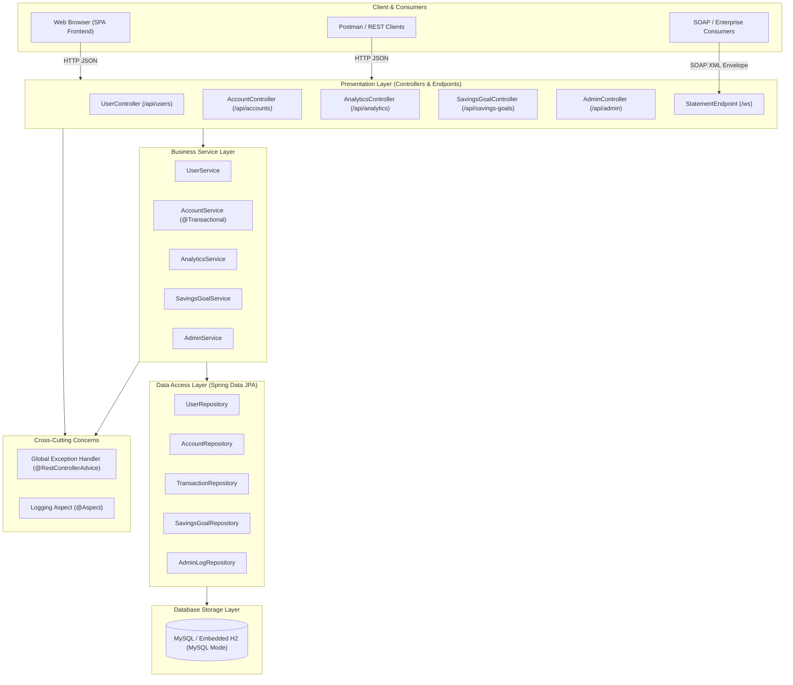
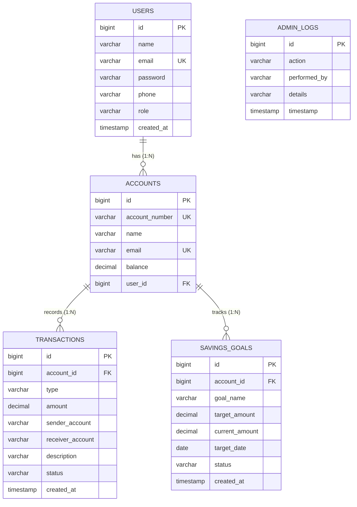

# Online Banking System — Enterprise API & Banking Platform

A full-featured, secure, and production-grade Online Banking application built with **Spring Boot 3**, **Spring Data JPA**, **MySQL / Embedded H2**, and **Spring Web Services (SOAP)**, complemented by a clean, responsive **HTML5, CSS3, and Vanilla JavaScript** single-page dashboard.

Designed and implemented for **B.Tech Academic Evaluation, Project Viva, and API & Microservices Demonstration**.

---

## 📋 Table of Contents
1. [Project Objective](#1-project-objective)
2. [Key Features](#2-key-features)
3. [System Modules](#3-system-modules)
4. [Technology Stack](#4-technology-stack)
5. [System Architecture](#5-system-architecture)
6. [Database Entities & Schema](#6-database-entities--schema)
7. [REST APIs Specification](#7-rest-apis-specification)
8. [SOAP Web Service (Account Statements)](#8-soap-web-service-account-statements)
9. [How to Run the Project (Step-by-Step)](#9-how-to-run-the-project-step-by-step)
10. [How to Test Using Postman](#10-how-to-test-using-postman)
11. [Sample API Requests & Responses](#11-sample-api-requests--responses)
12. [Screenshots & UI Showcase](#12-screenshots--ui-showcase)

---

## 1. Project Objective

The primary objective of this project is to develop a robust, enterprise-architected **Online Banking System** that fulfills all functional requirements of core modern retail banking while maintaining high modularity, transactional consistency, strict input validation, comprehensive audit logging, and interoperable SOAP integration.

### Core Goals:
- **Financial Integrity:** Guarantee atomic funds debit and credit execution using Spring's `@Transactional` rollback boundaries.
- **Security & Authorization:** Role-based access separation (`CUSTOMER` vs `ADMIN`), secure credential verification, and avoidance of password leaks through targeted Data Transfer Objects (DTOs).
- **Personal Financial Intelligence:** Compute real-time analytics on inflows, outflows, and net savings directly from immutable transaction records without heavy external dependencies.
- **Contract-First Interoperability:** Provide a SOAP 1.1 Web Service with dynamic WSDL generation for formal bank statement extraction.
- **Zero-Friction Demonstration:** Run with zero external database configuration via embedded H2 (MySQL mode) or switch smoothly to local MySQL Server with a single configuration flag.

---

## 2. Key Features

- ✅ **User Registration & Login:** Email uniqueness verification, input validation, and role tagging (`CUSTOMER`, `ADMIN`).
- ✅ **Customer-to-Account Relationship:** Linking multiple bank accounts to registered user profiles with automated account number generation.
- ✅ **Deposit Management:** Instant balance credit with positive amount validation and persistent audit trails.
- ✅ **Withdrawal Protection:** Immediate balance debit protected against overdrafts and negative amounts.
- ✅ **Atomic Fund Transfer:** High-speed peer-to-peer inter-account transfer guaranteeing rollback on insufficient funds or invalid destination accounts.
- ✅ **Dual-Leg Transaction Logging:** Generates `TRANSFER_OUT` on sender accounts and `TRANSFER_IN` on beneficiary accounts with timestamping and status flags.
- ✅ **Personal Finance Analytics:** Aggregates total deposits, withdrawals, transfers, transaction count, inflow/outflow, and net savings.
- ✅ **Savings Goals Tracker:** Goal creation, target vs current saved amount tracking, dynamic percentage progress calculation `(current / target * 100)%`, and automatic status transition to `COMPLETED`.
- ✅ **Admin Portal:** System-wide KPI dashboard, customer inventory, account monitoring, live transaction feeds, and administrative activity auditing.
- ✅ **Contract-First SOAP Service:** SAAJ/JAXB compliant endpoint at `/ws` publishing WSDL at `/ws/statement.wsdl` to deliver statement histories.
- ✅ **Spring AOP Logging:** Cross-cutting aspect (`@Aspect`) intercepting and logging method starts, completions, and exceptions while scrubbing sensitive credentials.
- ✅ **Global Exception Handling:** `@RestControllerAdvice` converting business domain exceptions into standardized, human-readable JSON payloads.
- ✅ **Responsive Dashboard:** 11 integrated sections with a Customer Hero card, quick action modals, widgets, and loading states.

---

## 3. System Modules

### 3.1 User & Authentication Module
- User entity management with unique email constraint, encrypted passwords, contact numbers, and system roles.
- APIs for user registration (`POST /api/users/register`) and user login (`POST /api/users/login`).
- Login response returns user details and role without exposing sensitive password hashes.

### 3.2 Account Management Module
- Opening of bank accounts with initial deposits, custom or auto-generated account numbers (`ACC-UUID`).
- Account lookup by primary key Account ID (`GET /api/accounts/{id}`) or unique Account Number (`GET /api/accounts/number/{accountNumber}`).
- User-to-account retrieval (`GET /api/users/{userId}/accounts`).

### 3.3 Money Management Module
- **Deposit API** (`POST /api/accounts/{id}/deposit`): Adds funds and records `DEPOSIT` transactions.
- **Withdraw API** (`POST /api/accounts/{id}/withdraw`): Validates sufficient funds, deducts balance, and records `WITHDRAW` transactions.
- **Fund Transfer API** (`POST /api/transactions/transfer`): Transfers funds atomically between two accounts using `@Transactional`.

### 3.4 Transaction Management & Auditing Module
- Records all balance-altering actions with transaction type (`DEPOSIT`, `WITHDRAW`, `TRANSFER_OUT`, `TRANSFER_IN`), amount, sender/receiver references, description, status (`SUCCESS`, `FAILED`), and timestamp.
- Chronological account transaction history (`GET /api/transactions/account/{accountId}`).

### 3.5 Personal Finance Analytics Module
- Derives instant financial metrics for any account without external batch processing.
- Metrics include: `totalDeposits`, `totalWithdrawals`, `totalTransfersSent`, `totalTransfersReceived`, `totalMoneyReceived`, `totalMoneySpent`, `netSavings`, `transactionCount`, and monthly aggregates.
- Endpoint: `GET /api/analytics/account/{accountId}`.

### 3.6 Savings Goal Module
- Enables users to define financial savings targets with target amounts, saved amounts, and optional target dates.
- Calculates progress percentage: `(currentAmount / targetAmount) * 100`.
- Automatically marks status as `COMPLETED` when the current saved amount reaches or exceeds the target.
- Full CRUD APIs: `POST`, `GET`, `PUT`, `DELETE` at `/api/savings-goals`.

### 3.7 Admin Module
- High-level system overview for bank administrators:
  - System dashboard with total registered users, accounts, transactions, total system balance, deposits, withdrawals, transfers, and goals.
  - User inventory, account directory, global transaction audit, and tamper-evident administrative action logging.
- Endpoints under `/api/admin/*`.

### 3.8 SOAP Account Statement Module
- Implements formal enterprise web service standards using XML, XSD schema definition, and SOAP 1.1 envelopes.
- Queries account details and full transaction statements using either `accountId` or `accountNumber`.
- Endpoint: `/ws`, dynamic WSDL: `/ws/statement.wsdl`.

### 3.9 Interactive Single-Page Frontend Module
- Clean, responsive dashboard connecting all 11 backend sections.
- Features Customer Hero Card, inline quick actions (Deposit, Withdraw, Transfer), real-time loading feedback, notification banners, and collapsible raw SOAP XML inspection.

---

## 4. Technology Stack

| Layer / Aspect | Technology | Version | Purpose |
|---|---|---|---|
| **Core Framework** | Spring Boot | 3.3.13 | Application configuration, dependency injection, and embedded web container |
| **Language** | Java JDK | 17+ (tested on 17 & 25) | Core object-oriented programming language |
| **Persistence (ORM)** | Spring Data JPA / Hibernate | 6.5.x | Object-relational mapping, repositories, and transactional queries |
| **Validation** | Jakarta Bean Validation (`hibernate-validator`) | 3.0.x | Strict DTO declarative validation (`@Valid`, `@NotNull`, `@DecimalMin`, etc.) |
| **Web Services (SOAP)** | Spring-WS (`spring-boot-starter-web-services`) | 4.0.x | Contract-first SOAP 1.1 web service engine |
| **WSDL & XML Binding** | WSDL4J, Jakarta XML Binding (JAXB) | 1.6.3 / 4.0.x | Dynamic WSDL publishing and XML marshalling/unmarshalling |
| **AOP Logging** | Spring AspectJ (`spring-boot-starter-aop`) | 3.3.x | Non-intrusive operational logging and performance tracking |
| **Database (Default)** | H2 In-Memory Database | 2.2.x | Zero-setup MySQL compatibility mode (`MODE=MySQL`) |
| **Database (Production)** | MySQL Community Server | 8.0+ | Production persistence (configured in `application.properties`) |
| **Frontend** | HTML5, CSS3, Vanilla JavaScript (ES6+) | Modern | Lightweight, responsive single-page portal with zero third-party dependencies |
| **Testing** | JUnit 5, Mockito, Spring Boot Test | 5.10.x | Unit tests, mock tests, and slice integration tests (57 tests) |
| **Build Automation** | Apache Maven | 3.8+ | Dependency management, compilation, packaging, and execution |

---

## 5. System Architecture

The application adopts a **Clean Layered Architecture** with strict separation of concerns, decoupling presentation logic from business rules and data persistence.



---

## 6. Database Entities & Schema

The relational schema is composed of five normalized JPA entities:



### Table Definitions:

#### 1. `users` Table
| Column | Type | Constraints | Description |
|---|---|---|---|
| `id` | `BIGINT` | Primary Key, Auto Increment | Unique user ID |
| `name` | `VARCHAR(100)` | NOT NULL | User full name |
| `email` | `VARCHAR(150)` | NOT NULL, UNIQUE | User login email address |
| `password` | `VARCHAR(255)` | NOT NULL | User password |
| `phone` | `VARCHAR(20)` | NULL | Contact phone number |
| `role` | `VARCHAR(30)` | NOT NULL | Role: `CUSTOMER` or `ADMIN` |
| `created_at` | `TIMESTAMP` | NOT NULL | User registration timestamp |

#### 2. `accounts` Table
| Column | Type | Constraints | Description |
|---|---|---|---|
| `id` | `BIGINT` | Primary Key, Auto Increment | Unique account ID |
| `account_number` | `VARCHAR(20)` | NOT NULL, UNIQUE | Human-readable account number |
| `name` | `VARCHAR(100)` | NOT NULL | Account holder name |
| `email` | `VARCHAR(150)` | NOT NULL, UNIQUE | Primary contact email |
| `balance` | `NUMERIC(19,2)` | NOT NULL | Current account balance |
| `user_id` | `BIGINT` | Foreign Key (users.id) | Linked user account (optional) |

#### 3. `transactions` Table
| Column | Type | Constraints | Description |
|---|---|---|---|
| `id` | `BIGINT` | Primary Key, Auto Increment | Unique transaction record ID |
| `account_id` | `BIGINT` | Foreign Key (accounts.id) | Owning bank account ID |
| `type` | `VARCHAR(20)` | NOT NULL | `DEPOSIT`, `WITHDRAW`, `TRANSFER_OUT`, `TRANSFER_IN` |
| `amount` | `NUMERIC(19,2)` | NOT NULL | Transaction financial amount |
| `sender_account` | `VARCHAR(30)` | NULL | Originating account number |
| `receiver_account` | `VARCHAR(30)` | NULL | Destination account number |
| `description` | `VARCHAR(255)` | NULL | Purpose / memo notes |
| `status` | `VARCHAR(20)` | NOT NULL | `SUCCESS`, `FAILED` |
| `created_at` | `TIMESTAMP` | NOT NULL | Timestamp of execution |

#### 4. `savings_goals` Table
| Column | Type | Constraints | Description |
|---|---|---|---|
| `id` | `BIGINT` | Primary Key, Auto Increment | Unique savings goal ID |
| `account_id` | `BIGINT` | Foreign Key (accounts.id) | Linked bank account ID |
| `goal_name` | `VARCHAR(100)` | NOT NULL | Title of financial target |
| `target_amount` | `NUMERIC(19,2)` | NOT NULL | Target funding goal (> 0) |
| `current_amount` | `NUMERIC(19,2)` | NOT NULL | Accumulated saved amount (>= 0) |
| `target_date` | `DATE` | NULL | Projected completion date |
| `status` | `VARCHAR(20)` | NOT NULL | `IN_PROGRESS` or `COMPLETED` |
| `created_at` | `TIMESTAMP` | NOT NULL | Creation timestamp |

#### 5. `admin_logs` Table
| Column | Type | Constraints | Description |
|---|---|---|---|
| `id` | `BIGINT` | Primary Key, Auto Increment | Unique audit log ID |
| `action` | `VARCHAR(100)` | NOT NULL | Operation performed |
| `performed_by` | `VARCHAR(100)` | NOT NULL | Identity or administrator name |
| `details` | `VARCHAR(500)` | NULL | Summary of action taken |
| `timestamp` | `TIMESTAMP` | NOT NULL | Event timestamp |

---

## 7. REST APIs Specification

All endpoints communicate using standard JSON payloads over HTTP.

### 7.1 User & Authentication APIs
| Method | Endpoint | Description | Status Codes |
|---|---|---|---|
| `POST` | `/api/users/register` | Register new customer or admin | `201 Created`, `400 Bad Request` |
| `POST` | `/api/users/login` | Authenticate user credentials | `200 OK`, `400 Bad Request`, `401 Unauthorized` |
| `GET` | `/api/users/{userId}/accounts` | List accounts belonging to a user | `200 OK`, `404 Not Found` |

### 7.2 Account Management APIs
| Method | Endpoint | Description | Status Codes |
|---|---|---|---|
| `POST` | `/api/accounts` | Open a new bank account | `201 Created`, `400 Bad Request` |
| `GET` | `/api/accounts/{id}` | Lookup account by primary key ID | `200 OK`, `404 Not Found` |
| `GET` | `/api/accounts/number/{accountNumber}` | Lookup account by unique Account Number | `200 OK`, `404 Not Found` |

### 7.3 Money Management & Fund Transfer APIs
| Method | Endpoint | Description | Status Codes |
|---|---|---|---|
| `POST` | `/api/accounts/{id}/deposit` | Deposit money into account | `200 OK`, `400 Bad Request`, `404 Not Found` |
| `POST` | `/api/accounts/{id}/withdraw` | Withdraw money (overdraft checked) | `200 OK`, `400 Bad Request`, `404 Not Found` |
| `POST` | `/api/transactions/transfer` | Atomic transfer between accounts | `200 OK`, `400 Bad Request`, `404 Not Found` |

### 7.4 Transaction Management APIs
| Method | Endpoint | Description | Status Codes |
|---|---|---|---|
| `GET` | `/api/transactions/account/{accountId}` | List transactions for account in reverse chronological order | `200 OK`, `404 Not Found` |

### 7.5 Personal Finance Analytics APIs
| Method | Endpoint | Description | Status Codes |
|---|---|---|---|
| `GET` | `/api/analytics/account/{accountId}` | Get deposit/withdrawal/transfer totals, count, and net savings | `200 OK`, `404 Not Found` |

### 7.6 Savings Goal APIs
| Method | Endpoint | Description | Status Codes |
|---|---|---|---|
| `POST` | `/api/savings-goals` | Create a new savings target | `201 Created`, `400 Bad Request`, `404 Not Found` |
| `GET` | `/api/savings-goals/{id}` | Get goal details and progress percentage | `200 OK`, `404 Not Found` |
| `GET` | `/api/savings-goals/account/{accountId}` | Get all savings goals for an account | `200 OK`, `404 Not Found` |
| `PUT` | `/api/savings-goals/{id}` | Update current saved amount (auto-completes) | `200 OK`, `400 Bad Request`, `404 Not Found` |
| `DELETE` | `/api/savings-goals/{id}` | Delete a savings goal | `200 OK`, `404 Not Found` |

### 7.7 Admin Portal APIs
| Method | Endpoint | Description | Status Codes |
|---|---|---|---|
| `GET` | `/api/admin/dashboard` | System-wide statistics and financial totals | `200 OK` |
| `GET` | `/api/admin/users` | List all users (passwords omitted) | `200 OK` |
| `GET` | `/api/admin/accounts` | List all bank accounts across system | `200 OK` |
| `GET` | `/api/admin/transactions` | Monitor system-wide live transactions | `200 OK` |
| `GET` | `/api/admin/logs` | View administrative audit action logs | `200 OK` |

---

## 8. SOAP Web Service (Account Statements)

A contract-first **SOAP 1.1 Web Service** is integrated using Spring Web Services (`spring-ws`) and SAAJ, operating on top of the existing JPA accounts and transactions.

- **SOAP Endpoint URL:** `POST http://localhost:8080/ws`
- **WSDL Definition URL:** `GET http://localhost:8080/ws/statement.wsdl`
- **Target Namespace:** `http://com.bank.mvp/soap/statement`
- **Schema Location:** `src/main/resources/statement.xsd`

### SOAP Statement Request Envelope (by Account Number or Account ID):
```xml
<?xml version="1.0" encoding="utf-8"?>
<soapenv:Envelope xmlns:soapenv="http://schemas.xmlsoap.org/soap/envelope/"
                  xmlns:tns="http://com.bank.mvp/soap/statement">
    <soapenv:Header/>
    <soapenv:Body>
        <tns:getStatementRequest>
            <tns:accountNumber>ACC-AUDIT-6204</tns:accountNumber>
        </tns:getStatementRequest>
    </soapenv:Body>
</soapenv:Envelope>
```

### SOAP Statement Response Envelope:
```xml
<SOAP-ENV:Envelope xmlns:SOAP-ENV="http://schemas.xmlsoap.org/soap/envelope/">
    <SOAP-ENV:Header/>
    <SOAP-ENV:Body>
        <ns2:getStatementResponse xmlns:ns2="http://com.bank.mvp/soap/statement">
            <ns2:accountNumber>ACC-AUDIT-6204</ns2:accountNumber>
            <ns2:accountHolder>Audit Test User</ns2:accountHolder>
            <ns2:currentBalance>18000.00</ns2:currentBalance>
            <ns2:transactionDetails>
                <ns2:id>11</ns2:id>
                <ns2:type>TRANSFER_OUT</ns2:type>
                <ns2:amount>4000.00</ns2:amount>
                <ns2:date>2026-10-03T01:15:02</ns2:date>
                <ns2:status>SUCCESS</ns2:status>
                <ns2:senderAccount>ACC-AUDIT-6204</ns2:senderAccount>
                <ns2:receiverAccount>ACC-BENEF-5291</ns2:receiverAccount>
                <ns2:description>Audit Inter-Account Transfer</ns2:description>
            </ns2:transactionDetails>
            <ns2:transactionDetails>
                <ns2:id>10</ns2:id>
                <ns2:type>WITHDRAW</ns2:type>
                <ns2:amount>3000.00</ns2:amount>
                <ns2:date>2026-10-03T01:15:02</ns2:date>
                <ns2:status>SUCCESS</ns2:status>
                <ns2:senderAccount>ACC-AUDIT-6204</ns2:senderAccount>
                <ns2:description>Withdrawal</ns2:description>
            </ns2:transactionDetails>
            <ns2:transactionDetails>
                <ns2:id>9</ns2:id>
                <ns2:type>DEPOSIT</ns2:type>
                <ns2:amount>5000.00</ns2:amount>
                <ns2:date>2026-10-03T01:15:02</ns2:date>
                <ns2:status>SUCCESS</ns2:status>
                <ns2:receiverAccount>ACC-AUDIT-6204</ns2:receiverAccount>
                <ns2:description>Deposit</ns2:description>
            </ns2:transactionDetails>
        </ns2:getStatementResponse>
    </SOAP-ENV:Body>
</SOAP-ENV:Envelope>
```

---

## 9. How to Run the Project (Step-by-Step)

### Prerequisites:
- **Java 17 or higher** installed (`java -version`).
- A modern web browser (Google Chrome, Microsoft Edge, Mozilla Firefox).
- *(Optional)* Apache Maven 3.8+.

---

### Step 1: Start the Backend Server

Choose **any one** of the following options:

#### Option A: One-Click Startup (Easiest for Windows)
Simply double-click **`run.bat`** in the project root folder.

#### Option B: Using Pre-Packaged Executable JAR (Recommended)
Open Command Prompt, PowerShell, or Terminal in the project root:
```bash
java -jar target/online-banking-mvp-0.0.1-SNAPSHOT.jar
```

#### Option C: Building & Running from Source with Maven
```bash
mvn spring-boot:run
```

---

### Step 2: Open the Frontend Application
Once the server logs show:
```
Tomcat started on port 8080 (http) with context path '/'
Started OnlineBankingMvpApplication in ... seconds
```

Open your browser and navigate to:
👉 **[http://localhost:8080/](http://localhost:8080/)**

---

### Step 3: Database Configuration (H2 vs MySQL)

#### Default (Zero-Setup Embedded H2 Mode):
The application runs out-of-the-box with in-memory H2 operating in MySQL compatibility mode. No local MySQL server installation is required.
- **H2 Web Console:** `http://localhost:8080/h2-console`
- **JDBC URL:** `jdbc:h2:mem:bankdb`
- **Username:** `sa`
- **Password:** *(leave blank)*

#### Switching to Local MySQL Server:
To store data in a persistent local MySQL database:
1. Open `src/main/resources/application.properties`.
2. Comment out the H2 datasource properties and uncomment the MySQL section:
   ```properties
   spring.datasource.url=jdbc:mysql://localhost:3306/online_banking_mvp?createDatabaseIfNotExist=true&useSSL=false&allowPublicKeyRetrieval=true&serverTimezone=UTC
   spring.datasource.username=root
   spring.datasource.password=YOUR_MYSQL_PASSWORD
   spring.datasource.driver-class-name=com.mysql.cj.jdbc.Driver
   spring.jpa.properties.hibernate.dialect=org.hibernate.dialect.MySQLDialect
   ```
3. Restart the application. Spring Boot will automatically create all tables on startup.

---

## 10. How to Test Using Postman

1. Open **Postman** and create a collection titled `Online Banking System`.
2. Set header `Content-Type: application/json` for REST requests, and `Content-Type: text/xml` for SOAP requests.

### Recommended Test Execution Sequence:

#### 1. Register a New Customer
- **Method:** `POST`
- **URL:** `http://localhost:8080/api/users/register`
- **Body:**
  ```json
  {
    "name": "Harry Potter",
    "email": "harry@hogwarts.com",
    "password": "magicpassword",
    "phone": "9876543210"
  }
  ```
- **Expected:** Status `201 Created` returning generated `id: 1`, `role: "CUSTOMER"`.

#### 2. User Login
- **Method:** `POST`
- **URL:** `http://localhost:8080/api/users/login`
- **Body:**
  ```json
  {
    "email": "harry@hogwarts.com",
    "password": "magicpassword"
  }
  ```
- **Expected:** Status `200 OK` with user details.

#### 3. Open Bank Account for Customer
- **Method:** `POST`
- **URL:** `http://localhost:8080/api/accounts`
- **Body:**
  ```json
  {
    "name": "Harry Potter",
    "email": "harry@hogwarts.com",
    "accountNumber": "ACC-HP-001",
    "initialBalance": 20000.00,
    "userId": 1
  }
  ```
- **Expected:** Status `201 Created` with Account ID `1` and Balance `20000.00`.

#### 4. Open Beneficiary Account
- **Method:** `POST`
- **URL:** `http://localhost:8080/api/accounts`
- **Body:**
  ```json
  {
    "name": "Hermione Granger",
    "email": "hermione@hogwarts.com",
    "accountNumber": "ACC-HG-002",
    "initialBalance": 5000.00
  }
  ```
- **Expected:** Status `201 Created` with Account ID `2`.

#### 5. Deposit Money
- **Method:** `POST`
- **URL:** `http://localhost:8080/api/accounts/1/deposit`
- **Body:** `{"amount": 5000.00}`
- **Expected:** Status `200 OK` with updated balance `25000.00`.

#### 6. Withdraw Money
- **Method:** `POST`
- **URL:** `http://localhost:8080/api/accounts/1/withdraw`
- **Body:** `{"amount": 2000.00}`
- **Expected:** Status `200 OK` with updated balance `23000.00`.

#### 7. Fund Transfer (Atomic Inter-Account)
- **Method:** `POST`
- **URL:** `http://localhost:8080/api/transactions/transfer`
- **Body:**
  ```json
  {
    "fromAccountId": 1,
    "toAccountId": 2,
    "amount": 3000.00,
    "description": "Book purchase reimbursement"
  }
  ```
- **Expected:** Status `200 OK`, `senderBalance: 20000.00`, status `SUCCESS`.

#### 8. Verify Overdraft Protection
- **Method:** `POST`
- **URL:** `http://localhost:8080/api/accounts/1/withdraw`
- **Body:** `{"amount": 999999.00}`
- **Expected:** Status `400 Bad Request` with `"Insufficient balance for withdrawal"`.

#### 9. Check Personal Finance Analytics
- **Method:** `GET`
- **URL:** `http://localhost:8080/api/analytics/account/1`
- **Expected:** Status `200 OK` returning `totalDeposits: 5000.00`, `totalWithdrawals: 2000.00`, `totalTransfers: 3000.00`, `transactionCount: 3`.

#### 10. Savings Goals Lifecycle
- **Create Goal:** `POST http://localhost:8080/api/savings-goals` with `{"accountId": 1, "goalName": "Nimbus 2000", "targetAmount": 10000.00, "currentAmount": 2500.00}` -> Returns `201 Created` with `progressPercentage: 25.0`.
- **Update Goal (Complete Target):** `PUT http://localhost:8080/api/savings-goals/1` with `{"currentAmount": 10000.00}` -> Status automatically transitions to `COMPLETED` (`100.0%`).

#### 11. Admin Module Operations
- **System Dashboard:** `GET http://localhost:8080/api/admin/dashboard`
- **User List:** `GET http://localhost:8080/api/admin/users`
- **Account Directory:** `GET http://localhost:8080/api/admin/accounts`
- **Global Transactions:** `GET http://localhost:8080/api/admin/transactions`
- **Activity Logs:** `GET http://localhost:8080/api/admin/logs`

#### 12. SOAP Statement Generation
- **Method:** `POST`
- **URL:** `http://localhost:8080/ws`
- **Header:** `Content-Type: text/xml`
- **Body (raw XML):**
  ```xml
  <soapenv:Envelope xmlns:soapenv="http://schemas.xmlsoap.org/soap/envelope/"
                    xmlns:tns="http://com.bank.mvp/soap/statement">
      <soapenv:Header/>
      <soapenv:Body>
          <tns:getStatementRequest>
              <tns:accountNumber>ACC-HP-001</tns:accountNumber>
          </tns:getStatementRequest>
      </soapenv:Body>
  </soapenv:Envelope>
  ```
- **Expected:** Status `200 OK` with full statement response XML.

---

## 11. Sample API Requests & Responses

### 11.1 User Registration (`POST /api/users/register`)
**Request:**
```json
{
  "name": "Alice Smith",
  "email": "alice@example.com",
  "password": "SecurePassword123",
  "phone": "9876543210"
}
```
**Response (`201 Created`):**
```json
{
  "id": 1,
  "name": "Alice Smith",
  "email": "alice@example.com",
  "phone": "9876543210",
  "role": "CUSTOMER",
  "createdAt": "2026-10-03T01:15:00.123456"
}
```

### 11.2 Fund Transfer (`POST /api/transactions/transfer`)
**Request:**
```json
{
  "fromAccountId": 1,
  "toAccountId": 2,
  "amount": 2500.00,
  "description": "Monthly rent share"
}
```
**Response (`200 OK`):**
```json
{
  "message": "Transfer successful",
  "transactionId": 5,
  "fromAccountId": 1,
  "fromAccountNumber": "ACC-HP-001",
  "toAccountId": 2,
  "toAccountNumber": "ACC-HG-002",
  "amount": 2500.00,
  "senderBalance": 17500.00,
  "status": "SUCCESS",
  "timestamp": "2026-10-03T01:15:02.789123"
}
```

### 11.3 Personal Finance Analytics (`GET /api/analytics/account/1`)
**Response (`200 OK`):**
```json
{
  "accountId": 1,
  "accountNumber": "ACC-HP-001",
  "currentBalance": 17500.00,
  "totalDeposits": 5000.00,
  "totalWithdrawals": 2000.00,
  "totalTransfersSent": 2500.00,
  "totalTransfersReceived": 0.00,
  "totalTransfers": 2500.00,
  "totalMoneyReceived": 5000.00,
  "totalMoneySpent": 4500.00,
  "netSavings": 500.00,
  "transactionCount": 3,
  "monthlySummary": [
    {
      "month": "2026-10",
      "totalDeposits": 5000.00,
      "totalWithdrawals": 2000.00,
      "totalTransfersSent": 2500.00,
      "totalTransfersReceived": 0.00,
      "inflow": 5000.00,
      "outflow": 4500.00,
      "transactionCount": 3
    }
  ]
}
```

### 11.4 Admin Dashboard KPI Statistics (`GET /api/admin/dashboard`)
**Response (`200 OK`):**
```json
{
  "totalUsers": 2,
  "totalAccounts": 2,
  "totalTransactions": 4,
  "totalDeposits": 5000.00,
  "totalWithdrawals": 2000.00,
  "totalTransfers": 2500.00,
  "totalSystemBalance": 25000.00,
  "totalSavingsGoals": 1
}
```

---

## 12. Screenshots & UI Showcase

The web application provides a responsive dashboard accessible at **`http://localhost:8080/`**. Below is the architectural layout of the integrated interface:

```
+-----------------------------------------------------------------------------------------+
| Online Banking System                       [Logged in: Harry Potter (CUSTOMER) | Logout] |
+-----------------------------------------------------------------------------------------+
| [📊 Dashboard] [🔐 Login/Register] [💳 Account Details] [📥 Deposit] [📤 Withdraw]      |
| [🔄 Fund Transfer] [📜 Transactions] [📈 Analytics] [🎯 Savings Goals] [🛡️ Admin]     |
+-----------------------------------------------------------------------------------------+
|                                                                                         |
|  +-----------------------------------------------------------------------------------+  |
|  | CUSTOMER HERO CARD                                                                |  |
|  | Account: ACC-HP-001 | Holder: Harry Potter                    [Switch Account: _] |  |
|  |                                                                                   |  |
|  | Available Balance:  ₹17,500.00                                                    |  |
|  |                                                                                   |  |
|  | [ 📥 Quick Deposit ]      [ 📤 Quick Withdraw ]      [ 🔄 Quick Transfer ]        |  |
|  +-----------------------------------------------------------------------------------+  |
|                                                                                         |
|  +-----------------------------------+   +-------------------------------------------+  |
|  | 📈 Analytics Summary              |   | 🎯 Savings Goal Progress                  |  |
|  | Deposits:    ₹5,000.00            |   | Nimbus 2000              [COMPLETED 100%] |  |
|  | Withdrawals: ₹2,000.00            |   | [=======================================] |  |
|  | Transfers:   ₹2,500.00            |   | Saved: ₹10,000.00 | Target: ₹10,000.00    |  |
|  | Net Savings:   ₹500.00            |   +-------------------------------------------+  |
|  +-----------------------------------+                                                  |
|                                                                                         |
|  +-----------------------------------------------------------------------------------+  |
|  | 📜 Recent Transactions (Live Real-time Feed)                                      |  |
|  | ID | Type         | Amount    | Sender     | Receiver   | Status  | Date          |  |
|  | 3  | TRANSFER_OUT | ₹2,500.00 | ACC-HP-001 | ACC-HG-002 | SUCCESS | 2026-10-03... |  |
|  | 2  | WITHDRAW     | ₹2,000.00 | ACC-HP-001 | —          | SUCCESS | 2026-10-03... |  |
|  | 1  | DEPOSIT      | ₹5,000.00 | —          | ACC-HP-001 | SUCCESS | 2026-10-03... |  |
|  +-----------------------------------------------------------------------------------+  |
|                                                                                         |
+-----------------------------------------------------------------------------------------+
```

### Presentation & Viva Checklist:
1. **Customer Flow:** Open `http://localhost:8080/`, log in or create an account, execute a Quick Deposit and Quick Transfer, and watch the balance and transaction feed update instantly.
2. **Analytics Demonstration:** Switch to the **Analytics** tab to show financial inflow vs. outflow and net savings calculation.
3. **Savings Goal Flow:** Create a goal in **Savings Goals**, add funds, and show the progress bar reaching 100% and auto-completing.
4. **Admin Demonstration:** Click **Admin Dashboard** (or log in with `admin@bank.com` / `admin123`) to showcase system-wide KPIs, customer directories, accounts table, and audit activity logs.
5. **SOAP Statement Interoperability:** Click **SOAP Statement**, enter an Account Number (e.g., `ACC-HP-001`), and click "Generate SOAP Statement" to show contract-first XML exchange with Spring-WS.